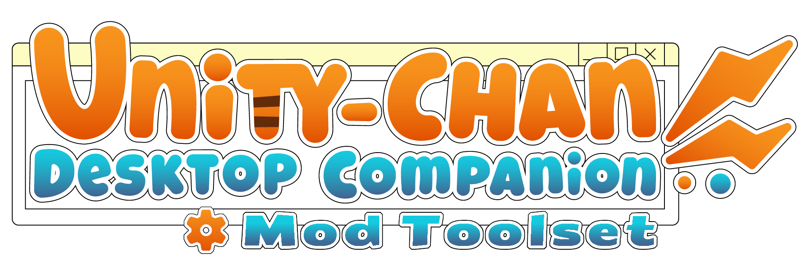

<!-- Banner Image -->
<p align="center">
  
</p>

# 🧰 UCDC Mod Toolset

Welcome! This project is a Mod Toolset for the game **Unity-Chan: Desktop Companion**.  
Its goal is to make modding the game smooth and easy.

If you have suggestions or find any issues, join our Discord server — we have a showcase section for your mods too!

[](https://discord.gg/UWpYYrFTuY)

---

## 📦 Requirements

- Unity **2023.2.20f1+** (LTS recommended)

---

## 🔨 Installation – Manual

1. Create an empty Unity project.
2. Download the latest `.unitypackage` from the [Releases tab](https://github.com/JacopoDev/UCDC-mod-toolset/releases).
3. Drag the `UCDC Mod Toolset.unitypackage` into your Unity project window.
4. Click `Import` and confirm that you want to import all files.

---

## 🚀 Installation – Unity Package Manager

1. Create an empty Unity project.
2. Open **Window → Package Manager**.
3. Click the **+** button and select **Add package from Git URL**.
4. Enter: `https://github.com/JacopoDev/UCDC-mod-toolset.git`
5. Click `Add` and wait for it to import.

---

## 🛠️ Creating Your First Mod

1. Do one of the installation steps as described above.
2. On the top bar, go to **Mod Tools → Create → New Mod**.
3. Enter a name for your mod. A folder will be created in `Assets/` for it.
4. Add a new script in this folder. For testing, paste the code below:
``` csharp
using System;
using System.Net;
using System.Threading.Tasks;
using UCDC_Mod_Api.GameInterfaces;
using UCDC_Mod_Api.Models.TextGen;
using UCDC_Mod_Api.ModInterfaces;
using UMod;

namespace Hello_World_Mod
{
    public class HelloWorld : ModScript, ITextAiAccessor
    {
        public void SetProvider(IAiApiProvider database)
        {
            database.SetActiveTextAccessor(this);
        }

        public int GenerateMessage(IChatProvider aiProcessor, Action<TextResult> finishedAction)
        {
            int result = SendAfterTime(finishedAction).Result;
            return result;
        }

        private async Task<int> SendAfterTime(Action<TextResult> finishedAction)
        {
            await Task.Delay(500);

            TextResult result = new TextResult()
            {
                Code = (int)HttpStatusCode.OK,
                Message = new Message()
                {
                    role = "assistant",
                    content = "Hello World!"
                }
            };

            finishedAction.Invoke(result);
            return result.Code;
        }
    }
}
```

5. On the top bar, go to **Mod Tools → Build Mod**.
6. Copy the resulting `.uccdcmod` file to `%USERPROFILE%/.unityChanCompanion/Mods/`.
7. Launch the game — Unity-chan should now say: **"Hello, World!"**
---

## 📁 Template Mods

Need examples? Check out the template mods here:

👉 [UCDC Mod Templates](https://github.com/JacopoDev/UCDC-Mod-Templates)  

If you want to focus on overriding Unity-chan model, there is separate set of template mods for VRM skin replacement:

👉 [UCDC VRM Skin Mod Templates](https://github.com/JacopoDev/UCDC-VRM-Skin-Mod-Templates)

Includes:
- Basic model override mod
- Advanced model override (AI prompt, ragdoll, face expressions, headpats)
- Text generation override mods
- Voice generation mods

---

## 📁 Mod Interfaces

If you want your scripts interact with the game code, you can use the mod interfaces provided by the library

Interfaces library is included in the toolset as `UCDC_Mod_Api.dll`.
If you'd like to see the repository for the library, you can find it here:

👉 [UCDC Mod API](https://github.com/JacopoDev/UCDC-Mod-API)

---

## 🧾 License

This toolset is provided under the [MIT License](LICENSE).  
You are free to use, modify, and distribute it.  
No warranty is provided.

---